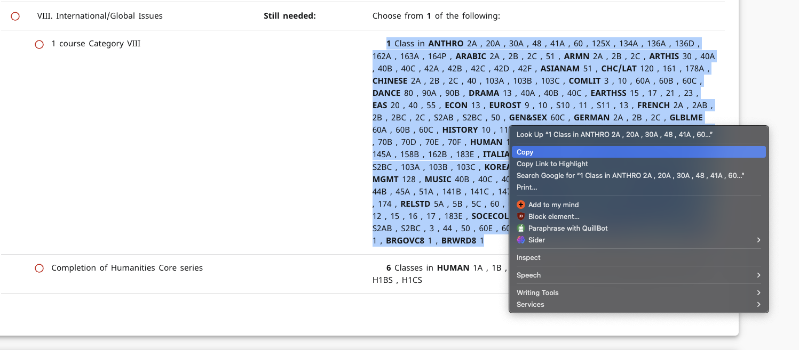

# DegreeWorks Course Finder: Your Shortcut to the Perfect Schedule!

Tired of endlessly clicking through course catalogs, trying to match your DegreeWorks requirements with open sections? **Say goodbye to the tedious manual search!** The DegreeWorks Course Finder is here to revolutionize how you plan your academic term.

Simply paste your requirement string from DegreeWorks, select your term, and instantly see all matching available sections neatly organized. **No more needing to search each course one by one** – find what you need, fast!

## ✨ Features

* **Effortless Input:** Just copy and paste your course requirement string directly from DegreeWorks.
* **Term Selection:** Easily choose the specific year and quarter (Fall, Winter, Spring, Summer Sessions) you're planning for.
* **Instant Results:** Get a comprehensive list of matching courses and their sections in seconds.
* **Clear, Grouped View:** Sections are intelligently grouped by type (Lecture, Discussion, Lab) within each course card.
* **Availability Filters:** Quickly toggle between viewing all sections, only available (open) sections, or only unavailable ones.
* **Collapsible Course Cards:** Keep your view tidy by expanding only the courses you're interested in. Expand/Collapse All buttons for convenience!
* **Visual Status:** Available courses are highlighted green, and section statuses (Open, Waitlisted, Full) are clearly marked with badges.
* **Responsive Design:** Looks and works great on desktop, tablet, or mobile. Plan your schedule anywhere!
* **Real-time Progress:** A subtle indicator lets you know the search is underway.

## 🛠️ Get Up and Running

Setting up is a breeze:
1.  **Clone the Repository:**
    ```bash
    git clone https://github.com/DarrenZhao01/Degreeworks-Grabber.git
    cd Degreeworks-Grabber
    ```
2.  **Install Dependencies:** Make sure you have Python 3.7+ installed, then run:
    ```bash
    pip install -r requirements.txt
    ```
    *(This installs Flask, Requests, and python-dotenv)*

3.  **Set up API Key:**
    - Create a `.env` file in the root directory based on the provided `.env.example`
    - Add your Anteater API key to the `.env` file
    ```
    ANTEATER_API_SECRET_KEY=your_api_key_here
    ```
    - If you don't have an API key, please obtain one from the [Anteater API](https://anteaterapi.com) service

4.  **Launch the App:**
    ```bash
    python app.py
    ```
5.  **Open in Browser:** Navigate to `http://127.0.0.1:5000` (or `http://localhost:5000`) in your web browser.

## How to Use

1.  **Copy and Paste:** Copy the course requirement string from your DegreeWorks audit (e.g., `COMPSCI 111, 121, 161, STATS 67, 68`). Paste it into the text area.

2.  **Select:** Choose the correct Year and Quarter.

3.  **Click:** Hit the "Find Courses" button.

4.  **View & Filter:** Explore the results! Use the tabs ("Available Only", "Unavailable Only", "Show All") to filter courses. Click on any course header to expand or collapse its details. Use the "Expand All" / "Collapse All" buttons to manage the view for the current tab.


## Requirements

* Python 3.7 or higher
* Flask
* Requests
* python-dotenv
* A modern web browser
* Anteater API key (for accessing course data)

---

Spend less time searching and more time building your schedule. Happy scheduling!